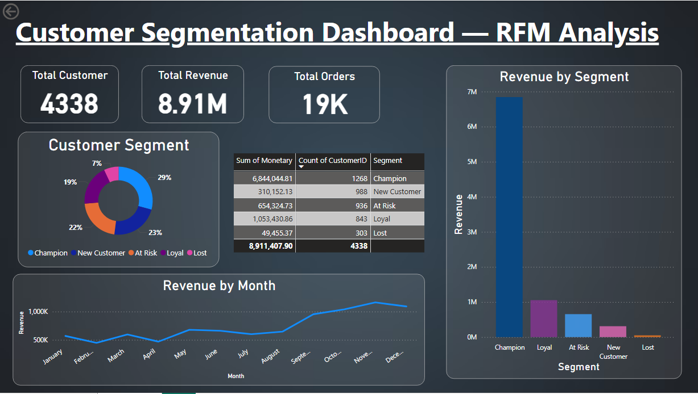

# 🛒 Customer Segmentation using RFM Analysis



## 📌 Project Overview
This project performs **customer segmentation** on a real-world online retail dataset using the **RFM (Recency, Frequency, Monetary)** methodology. The goal is to help businesses identify different types of customers and target them more effectively.

---

## 🎯 Business Problem
Not all customers are equal. Some buy frequently and spend a lot, while others haven't purchased in months. This project answers:
- Who are our most valuable customers?
- Which customers are at risk of leaving?
- How can we re-engage lost customers?

---

## 📊 Key Findings
- 📦 **4,338 total customers** analyzed across **37 countries**
- 💰 **Total Revenue: £8.91M** from 500K+ transactions
- 🏆 **Champion customers (29%)** contribute **£6.84M — 77% of total revenue**
- 📈 **Revenue grew steadily** from £500K (Jan) to £1M+ (Dec) with a holiday spike in Nov–Dec
- 🔁 **303 lost customers** represent a major re-engagement opportunity

---

## 🛠️ Tools & Technologies
| Tool | Purpose |
|------|---------|
| Python (Pandas) | Data cleaning & RFM calculation |
| Matplotlib / Seaborn | Data visualization |
| Power BI | Interactive dashboard |
| Jupyter Notebook | Analysis environment |
| VS Code | Code editor |

---

## 📁 Project Structure
```
customer-segmentation-rfm/
│
├── rfm_analysis.ipynb        ← Main Python analysis notebook
├── rfm_dashboard.pbix        ← Power BI dashboard file
├── README.md                 ← Project documentation
│
├── data/
│   ├── rfm_output.csv        ← RFM scores per customer
│   └── monthly_revenue.csv   ← Monthly revenue trend data
│
└── images/
    ├── dashboard.png         ← Power BI dashboard screenshot
    └── segments.png          ← Customer segment chart
```

---

## 📂 Dataset
- **Source:** [UCI Machine Learning Repository — Online Retail Dataset](https://archive.ics.uci.edu/dataset/352/online+retail)
- **Period:** December 2010 – December 2011
- **Size:** 541,909 transactions
- **Description:** Transactions from a UK-based online retail store selling unique all-occasion gifts

> Note: The raw dataset is not included due to file size. Download it from the UCI link above.

---

## 🔍 RFM Methodology

| Metric | Definition | Meaning |
|--------|-----------|---------|
| **Recency (R)** | Days since last purchase | Lower = better |
| **Frequency (F)** | Number of orders placed | Higher = better |
| **Monetary (M)** | Total amount spent | Higher = better |

Each customer receives a score of 1–4 for each metric, which are combined to assign a segment.

---

## 👥 Customer Segments

| Segment | Description | Count | Revenue |
|---------|-------------|-------|---------|
| 🏆 Champion | Buy recently, often & spend most | 1,268 | £6.84M |
| 💚 Loyal | Regular buyers with good spending | 843 | £1.05M |
| ⚠️ At Risk | Used to buy but haven't recently | 936 | £654K |
| 🌱 New Customer | Recent first-time buyers | 988 | £310K |
| 😴 Lost | Haven't bought in a long time | 303 | £49K |

---

## ⚙️ How to Run This Project

### 1. Clone the repository
```bash
git clone https://github.com/your-username/customer-segmentation-rfm.git
cd customer-segmentation-rfm
```

### 2. Install required libraries
```bash
pip install pandas matplotlib seaborn openpyxl jupyter
```

### 3. Download the dataset
- Go to [UCI Online Retail Dataset](https://archive.ics.uci.edu/dataset/352/online+retail)
- Download and place `Online Retail.xlsx` inside the `data/` folder

### 4. Run the notebook
```bash
jupyter notebook rfm_analysis.ipynb
```

### 5. View the dashboard
- Open `rfm_dashboard.pbix` in **Power BI Desktop**

---

## 📈 Dashboard Preview


The interactive Power BI dashboard includes:
- KPI cards (Total Customers, Total Revenue, Total Orders)
- Donut chart showing customer segment distribution
- Bar chart comparing revenue by segment
- Line chart showing monthly revenue trend
- Summary table with segment-level breakdown

---

## 💡 Business Recommendations

Based on the RFM analysis:

1. **Champions** — Reward them with loyalty programs and early access to new products
2. **At Risk customers** — Send win-back campaigns with special discounts
3. **Lost customers** — Target with aggressive re-engagement emails
4. **New customers** — Nurture with onboarding offers to convert them to loyal buyers

---

## 🙋 Author
**Vidhi Mittal **
- 📧 vidhimittal353@gmail.com
- 💼 [LinkedIn](https://www.linkedin.com/in/vidhi-mittal-30a07a303/)
- 🐙 [GitHub](https://github.com/vidhim06)

---

## 📜 License
This project is open source and available under the [MIT License](LICENSE).

---

⭐ If you found this project helpful, please give it a star!
